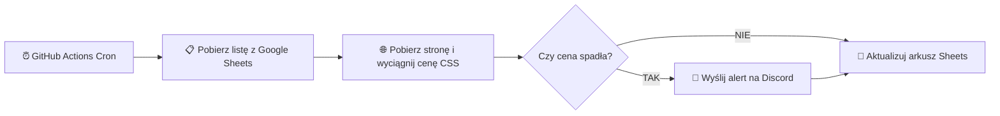

# 💰 Price Tracker

[](https://nodejs.org/)
[](https://opensource.org/licenses/MIT)
[](https://developers.google.com/sheets/api)
[](https://discord.com)
[](https://github.com/features/actions)

Bezserwerowy, zautomatyzowany tracker cen produktów ze sklepów internetowych. Działa w 100% za darmo w chmurze (**GitHub Actions**), przechowuje dane w **Google Sheets** i natychmiast wysyła powiadomienia o obniżkach na **Discord**.

---

## ⚡ Główne funkcje

- 🤖 **100% Automatyzacji**: Działa w chmurze bez potrzeby utrzymywania własnego serwera czy włączonego komputera.
- 📊 **Wygodny panel w Google Sheets**: Zarządzaj listą produktów, linkami i progami alertów bezpośrednio w arkuszu kalkulacyjnym.
- 🚨 **Alerty Discord**: Estetyczne powiadomienia w formie embedów ze starą i nową ceną, wyliczoną różnicą kwotową i procentową.
- 🛡️ **Dwufazowy scraping antybotowy**:
  - **Faza 1 (Direct)**: Losowa rotacja realistycznych User-Agentów i nagłówków przeglądarki.
  - **Faza 2 (Proxy Fallback)**: Automatyczne przekierowanie przez **ScraperAPI** w przypadku wykrycia blokad (HTTP 403 / Cloudflare).
- 🔢 **Inteligentny parser cen (`parsePrice`)**: Niezawodnie obsługuje formaty polskie i międzynarodowe (`1 234,56 zł`, `1,234.56`, `239,99 zł.` itp.).
- 🏷️ **Inteligentne kupony i rabaty**: Automatyczna detekcja kodów promocyjnych (np. Zalando, Modivo, Wojas, Answear). Dla rabatów kwotowych z minimalnym zamówieniem (np. Zalando -50 zł od 300 zł) system wylicza rzeczywisty rabat proporcjonalnie przy dobitce koszyka (+10 zł), gdy cena produktu jest poniżej progu.
- 📈 **Śledzenie historii**: Automat zapisuje bieżącą cenę, historycznie najniższą cenę oraz dokładny znacznik czasu ostatniej weryfikacji.

---

## 🔄 Jak to działa?



---

## 📚 Pełna dokumentacja

Szczegółowe poradniki i dokumentacja techniczna znajdują się w katalogu `docs/`:

- 🏛️ **[Architektura Systemu](docs/ARCHITECTURE.md)** — Opis modułów, diagramy sekwencji, przepływ danych i obsługa błędów.
- ⚙️ **[Instrukcja Konfiguracji Krok po Kroku](docs/CONFIGURATION.md)** — Konfiguracja Google Cloud Service Account, arkusza, Discorda i GitHub Actions.
- 🔍 **[Przewodnik po Scrapingu i Selektorach CSS](docs/SCRAPING_GUIDE.md)** — Jak dobierać selektory, testować je w DevTools i omijać zabezpieczenia.

---

## 🚀 Szybki start (Konfiguracja w 10 minut)

### 1. Przygotuj arkusz Google Sheets
W arkuszu przygotuj dwie zakładki o nazwach **`Produkty`** oraz **`Domeny`**:

#### Zakładka 1: `Produkty` (Monitorowane artykuły)
Nagłówki w wierszu 1 (od A do M):

| A | B | C | D | E | F | G | H | I | J | K | L | M |
|---|---|---|---|---|---|---|---|---|---|---|---|---|
| **Nazwa** | **URL** | **Selektor Ceny** | **Selektor Rabatu** | **Cena bez rabatu** | **Rabat** | **Cena z rabatem** | **Najniższa bez rabatu** | **Najniższa z rabatem** | **Największy zarejestrowany rabat** | **Alert poniżej** | **Ostatnie sprawdzenie** | **Licznik błędów** |

- **Wypełniasz ręcznie**:
  - **A (Nazwa)** i **B (URL)** — wymagane dla każdego wiersza.
  - **C (Selektor Ceny)** i **D (Selektor Rabatu)** — opcjonalne! Jeśli pozostawisz puste, skrypt automatycznie pobierze domyślny selektor z zakładki `Domeny`.
  - **K (Alert poniżej)** — opcjonalna kwota wyzwalająca alert priorytetowy 🚨.
- **Wypełnia automat**:
  - Kolumny **E–J** (aktualne ceny bazowe, rabaty wyliczone kwotowo/procentowo, ceny po rabacie, historia najniższych cen i najlepszy rabat).
  - Kolumny **L–M** (data ostatniego sprawdzenia oraz licznik kolejnych nieudanych prób pobrania).

#### Zakładka 2: `Domeny` (Domyślne selektory per sklep)
Nagłówki w wierszu 1:

| A | B | C | D |
|---|---|---|---|
| **Domena** | **Selektor Ceny** | **Selektor Rabatu** | **Uwagi** |

Przykładowe konfiguracje:
- `footshop.pl` | `[itemprop="price"]` | *(puste)*
- `modivo.pl` | `price > .price-container > .price-wrapper` | `promotion-badge`
- `wojas.pl` | `#priceSelected` | `.box-list-product-code`
- `zalando.pl` | `[data-testid="pdp-price-container"] span` | *(puste — kupony i progi pobierane automatycznie z danych strony)*

### 2. Utwórz Google Cloud Service Account
1. Wejdź na [Google Cloud Console](https://console.cloud.google.com/), stwórz projekt i włącz **Google Sheets API**.
2. W **IAM & Admin → Service Accounts** utwórz konto serwisowe i wygeneruj klucz w formacie **JSON**.
3. Udostępnij swój arkusz Google Sheets na adres `client_email` z pobranego pliku JSON z uprawnieniami **Edytor**.

### 3. Skonfiguruj Webhook Discord
W ustawieniach wybranego kanału Discord przejdź do **Integracje → Webhooki → Nowy Webhook** i skopiuj jego URL.

### 4. Dodaj sekrety w repozytorium GitHub
W swoim repozytorium na GitHubie przejdź do **Settings → Secrets and variables → Actions** i dodaj:

| Nazwa sekretu | Opis |
|---|---|
| `GOOGLE_SERVICE_ACCOUNT_EMAIL` | Adres `client_email` z pliku JSON |
| `GOOGLE_PRIVATE_KEY` | Cały klucz prywatny `private_key` (wraz z nagłówkami BEGIN/END) |
| `SPREADSHEET_ID` | Identyfikator arkusza z adresu URL (`/d/<ID>/edit`) |
| `DISCORD_WEBHOOK_URL` | Adres URL webhooka Discord |
| `SCRAPER_API_KEY` | *(Opcjonalnie)* Darmowy klucz z [ScraperAPI](https://www.scraperapi.com/) do omijania blokad |

Po dodaniu sekretów przejdź do zakładki **Actions** w GitHubie i uruchom wybrany workflow (Pełny lub Szybki) ręcznie, używając przycisku *Run workflow*.
*(Automatyczne harmonogramy zostały wyłączone, aby oszczędzać limit minut w GitHub Actions - czytaj FAQ).*

---

## 🔍 Przykładowe selektory CSS dla sklepów

| Sklep | Przykładowy selektor |
|---|---|
| **x-kom.pl** | `.product-price` lub `[data-price]` |
| **morele.net** | `.product-price` |
| **mediaexpert.pl** | `.is-price` |
| **euro.com.pl** | `.product-price .price-normal` |
| **amazon.pl** | `.a-price .a-offscreen` |
| **ceneo.pl** | `.product-offer__price .price` |

> 💡 **Wskazówka:** Przetestuj selektor w konsoli przeglądarki (`F12`):
> ```javascript
> document.querySelector('TWÓJ_SELEKTOR').textContent.trim()
> ```
> Więcej informacji znajdziesz w [Przewodniku po Scrapingu](docs/SCRAPING_GUIDE.md).

---

## 🛠️ Uruchomienie lokalne

```bash
# 1. Klonowanie i instalacja zależności
git clone https://github.com/twoj-login/price-tracker.git
cd price-tracker
npm install

# 2. Konfiguracja zmiennych środowiskowych
cp .env.example .env
# Edytuj plik .env i wklej swoje klucze

# 3. Uruchomienie sprawdzania cen
npm run check
```

---

## 📁 Struktura projektu

```
price-tracker/
├── .github/
│   └── workflows/
│       ├── price-check-full.yml  # Obieg pełny (z użyciem ScraperAPI)
│       └── price-check-fast.yml  # Obieg szybki (bez ScraperAPI, pomija blokady)
├── docs/                     # Dokumentacja szczegółowa
│   ├── ARCHITECTURE.md       # Architektura, przepływ danych, moduły
│   ├── CONFIGURATION.md      # Instrukcja konfiguracji usług krok po kroku
│   └── SCRAPING_GUIDE.md     # Poradnik dobierania selektorów CSS i parsera cen
├── src/
│   ├── index.js              # Główny skrypt orkiestrujący
│   ├── scraper.js            # Pobieranie stron, nagłówki, fallback ScraperAPI, parser
│   ├── sheets.js             # Komunikacja z Google Sheets API v4
│   └── discord.js            # Wysyłanie powiadomień i podsumowań na Discord
├── .env.example              # Szablon zmiennych środowiskowych
├── package.json              # Zależności i skrypty npm
└── README.md                 # Główny dokument repozytorium
```

---

## ❓ Najczęstsze pytania (FAQ)

<details>
<summary><b>Jak często skrypt sprawdza ceny?</b></summary>

Domyślnie projekt posiada dwa niezależne obiegi (workflows): **Pełny** i **Szybki**.
Zostały one skonfigurowane do uruchamiania **ręcznego** (z zakładki Actions na GitHubie). Automatyczne harmonogramy (`cron`) zostały wyłączone, aby uniknąć szybkiego wyczerpania 2000 minut miesięcznie dostępnych za darmo dla prywatnych repozytoriów.

Jeśli chcesz je zautomatyzować za darmo:
1. **GitHub Self-Hosted Runner**: Skonfiguruj własny komputer jako runner dla GitHuba (brak limitu minut).
2. **Oracle Cloud VPS**: Wrzuć kod na darmowy serwer (Always Free) i użyj systemowego `crona`.
3. **Publiczne repozytorium**: Zmień widoczność repo na Publiczną (GitHub znosi wtedy limit 2000 minut dla Actions), po czym przywróć konfigurację `schedule` w plikach YAML.
</details>

<details>
<summary><b>Jak dodać własny, jednorazowy kod rabatowy z e-maila?</b></summary>

Projekt wspiera wprowadzanie prywatnych kodów rabatowych (np. kod zniżkowy -15% dla Zalando, który masz na skrzynce mailowej). Aby to zrobić:
1. Otwórz plik `src/index.js` w repozytorium.
2. Na samej górze znajdź zmienną `ZALANDO_CUSTOM_PROMO` (lub analogiczną dla innych sklepów).
3. Podmień wartość `percent` (np. na `15`) oraz wpisz swój kod w polu `code`. Zaktualizuj też `expiryDate`.
Skrypt sam wykryje, czy podany kod daje lepszą cenę niż ewentualna wyprzedaż dostępna publicznie na stronie, oraz (w przypadku Zalando) upewni się, że produkt jest sprzedawany przez samo Zalando, a nie partnera zewnętrznego. Po zużyciu jednorazowego kodu w sklepie, pamiętaj aby zmienić z powrotem `percent: 0`!
</details>

<details>
<summary><b>Co zrobić, gdy cena zwraca błąd lub null?</b></summary>

Upewnij się, że strona nie renderuje ceny dynamicznie przez JavaScript po załadowaniu szkieletu HTML. Jeśli sklep blokuje ruch kodem 403 (Cloudflare), dodaj darmowy klucz `SCRAPER_API_KEY`.
</details>

<details>
<summary><b>Czy korzystanie z GitHub Actions jest płatne?</b></summary>

Dla publicznych repozytoriów GitHub Actions są **w 100% darmowe i nielimitowane**. Dla prywatnych repozytoriów otrzymujesz 2000 darmowych minut miesięcznie (skrypt uruchamiany dwa razy dziennie zużywa jedynie kilkadziesiąt minut w miesiącu).
</details>

---

## 📄 Licencja

Projekt jest udostępniany na licencji MIT. Szczegóły w pliku LICENSE (o ile dodany).
