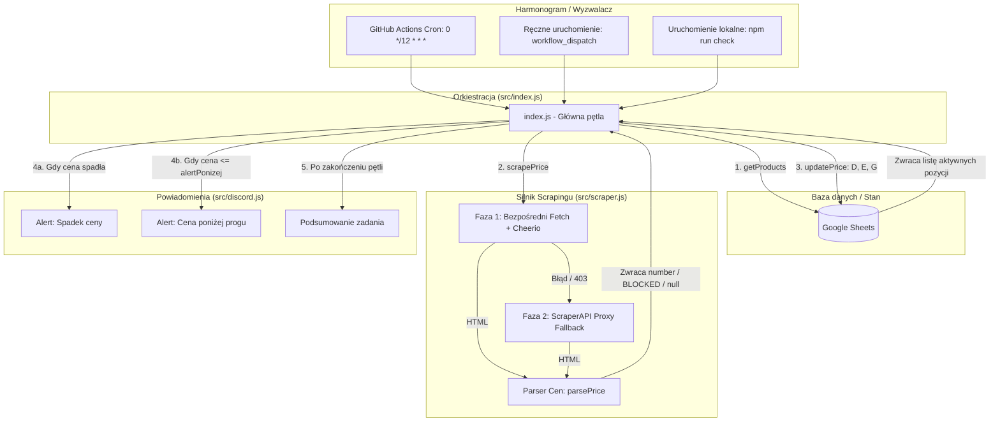
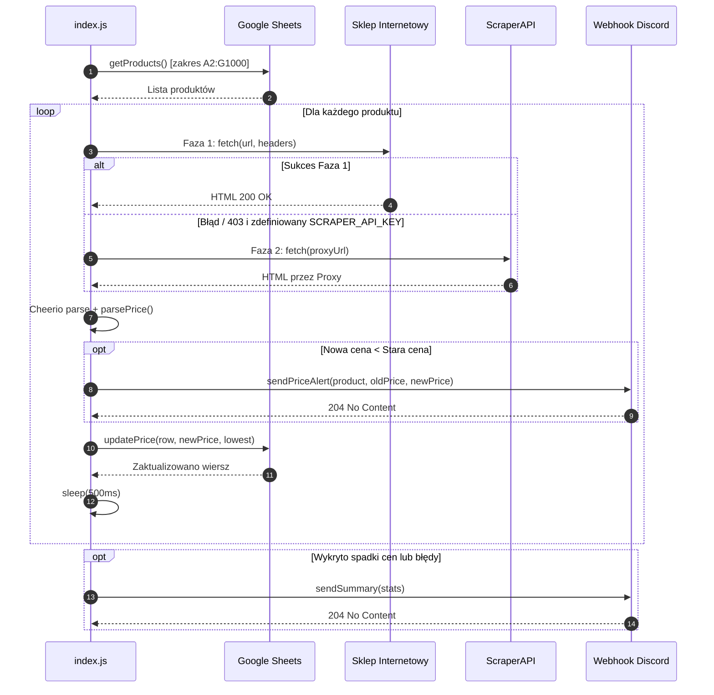

# 🏛️ Architektura Systemu — Price Tracker

Dokument ten opisuje strukturę techniczną, przepływ danych, podział na moduły oraz mechanizmy odpornościowe aplikacji **Price Tracker**.

---

## 1. Przegląd ogólny

Price Tracker to bezserwerowa aplikacja napisana w środowisku **Node.js (ES Modules)**, zaprojektowana z myślą o uruchamianiu w środowisku CI/CD (**GitHub Actions**) lub w środowisku lokalnym. Aplikacja nie wymaga własnej bazy danych ani stałego serwera — stan przechowywany jest bezpośrednio w **Google Sheets**, a komunikacja z użytkownikiem odbywa się poprzez webhooki **Discord**.



---

## 2. Podział na moduły

Struktura kodu zorganizowana jest w katalogu `src/` w postaci czterech wyspecjalizowanych modułów:

```
price-tracker/
├── .github/
│   └── workflows/
│       └── price-check.yml   # Definicja harmonogramu GitHub Actions
├── docs/                     # Dokumentacja techniczna i poradniki
│   ├── ARCHITECTURE.md       # Ten plik
│   ├── CONFIGURATION.md      # Konfiguracja usług zewnętrznych
│   └── SCRAPING_GUIDE.md     # Dobór selektorów i parsowanie cen
├── src/
│   ├── index.js              # Główny punkt wejścia i orkiestracja
│   ├── scraper.js            # Pobieranie stron, nagłówki, Cheerio, parser cen
│   ├── sheets.js             # Integracja z Google Sheets API v4
│   └── discord.js            # Generowanie i wysyłka embedów Discord
├── .env.example              # Szablon zmiennych środowiskowych
├── package.json              # Konfiguracja projektu i zależności (ESM)
└── README.md                 # Główny opis projektu
```

---

### Moduł 1: `src/index.js` (Orkiestrator)

Odpowiada za sterowanie całym procesem wykonawczym:
1. **Inicjalizacja**: Loguje czas rozpoczęcia (strefa czasowa `Europe/Warsaw`).
2. **Pobranie danych**: Wywołuje `getProducts()` z `sheets.js`. Jeśli arkusz jest pusty lub wystąpił błąd autoryzacji, natychmiast kończy wykonanie.
3. **Pętla przetwarzania**:
   - Dla każdego produktu wywołuje `scrapePrice(product.url, product.selektor)`.
   - Klasyfikuje wynik: sukces, błąd `BLOCKED` (kod HTTP 403), błąd selektora/timeoutu (`null`).
   - Porównuje nową cenę z poprzednią (`product.cena`):
     - Wykrywa spadek ceny.
     - Sprawdza, czy cena osiągnęła zdefiniowany próg `product.alertPonizej`.
     - Przy pierwszym sprawdzeniu (`oldPrice === null`) jedynie inicjalizuje bazę.
   - Aktualizuje wiersz w arkuszu (`updatePrice`).
   - Wprowadza opóźnienie 500 ms (`setTimeout`) pomiędzy kolejnymi zapytaniami, aby zapobiec nagłym skokom obciążenia.
4. **Raportowanie**: Zbiera statystyki przebiegu i przesyła podsumowanie przez `sendSummary(stats)`.

---

### Moduł 2: `src/scraper.js` (Silnik Scrapingu)

Implementuje dwufazowy mechanizm pobierania i ekstrakcji cen:

#### Faza 1: Zapytanie bezpośrednie (Direct Fetch)
- Wykorzystuje natywne `fetch` z Node.js z limitem czasu 45 sekund (`AbortSignal.timeout(45000)`).
- Generuje realistyczne nagłówki przeglądarki (`buildHeaders`):
  - Losowy `User-Agent` z puli nowoczesnych przeglądarek (Chrome Win/Mac/Linux, Firefox).
  - Nagłówki Sec-Fetch (`Sec-Fetch-Dest: document`, `Sec-Fetch-Mode: navigate`, `Sec-Fetch-Site: same-origin`).
  - Nagłówki `Accept`, `Accept-Language: pl-PL,pl;...`, `Referer`, `Cache-Control`.
- Wykonuje do **2 prób** z losowym odstępem czasu (1000–3000 ms) w przypadku błędu.
- Parsuje HTML za pomocą **Cheerio** (`cheerio.load(html)`).

#### Faza 2: ScraperAPI Proxy Fallback
- Jeśli Faza 1 nie przyniesie rezultatu (np. blokada antybotowa Cloudflare / Akamai) oraz zdefiniowano zmienną `SCRAPER_API_KEY`, zapytanie kierowane jest przez bramkę proxy `api.scraperapi.com`.
- Pozwala to ominąć zaawansowane filtry geolokalizacyjne i CAPTCHA.

#### Funkcja `parsePrice(text)`
Ekstrahuje wartość liczbową typu `number` z surowego tekstu strony:
- Usuwa jednostki walutowe (np. `zł`, `PLN`, `$`, `€`) i białe znaki (w tym spacje niełamliwe `\u00A0`).
- Automatycznie rozpoznaje przecinek lub kropkę jako separator dziesiętny.
- Waliduje poprawność wyniku (`> 0` oraz `!isNaN`).

---

### Moduł 3: `src/sheets.js` (Warstwa Danych)

Zarządza komunikacją z Google Sheets API:
- **Autoryzacja**: Obsługiwana przez `google.auth.GoogleAuth` przy użyciu konta serwisowego (Service Account) z uprawnieniem do modyfikacji arkusza (`scope: https://www.googleapis.com/auth/spreadsheets`).
- **Pobieranie produktów (`getProducts`)**:
  - Odczytuje zakres `A2:G1000` jednym zapytaniem `spreadsheets.values.get`.
  - Parsuje i mapuje kolumny do obiektów JavaScript:
    - Kolumna A (0): `nazwa`
    - Kolumna B (1): `url`
    - Kolumna C (2): `selektor`
    - Kolumna D (3): `cena`
    - Kolumna E (4): `najnizsza`
    - Kolumna F (5): `alertPonizej`
    - Kolumna G (6): `ostatnieSprawdzenie`
  - Filtruje wiersze puste lub niekompletne (wymagane: `nazwa`, `url`, `selektor`).
- **Zapis danych (`updatePrice`)**:
  - Wykorzystuje metodę `spreadsheets.values.batchUpdate` z parametrem `valueInputOption: 'USER_ENTERED'`.
  - Atomowo aktualizuje kolumny: `D{row}` (Cena), `E{row}` (Najniższa odnotowana cena), `G{row}` (Znacznik czasu w strefie `Europe/Warsaw`).

---

### Moduł 4: `src/discord.js` (Powiadomienia)

Wysyła sformatowane komunikaty (Discord Embeds) na podany Webhook:
- **Alert o spadku ceny (`sendPriceAlert`)**:
  - Zielony pasek boczny (`0x00c853`) dla zwykłego spadku ceny.
  - Czerwony pasek boczny (`0xff0000`) z ikoną 🚨, gdy nowa cena $\le$ zdefiniowany próg (`alertPonizej`).
  - Prezentuje starą cenę (przekreśloną), nową cenę (pogrubioną), różnicę kwotową oraz zmianę procentową.
- **Raport podsumowujący (`sendSummary`)**:
  - Niebieski pasek boczny (`0x2196f3`).
  - Wysyłany **tylko wtedy**, gdy odnotowano spadki cen lub wystąpiły rzeczywiste błędy (np. niepoprawny selektor, niedostępność serwera). Ignoruje ciche blokady 403, aby uniknąć zbędnego szumu informacyjnego.

---

## 3. Cykl życia pojedynczego uruchomienia (Execution Flow)

Poniższy diagram sekwencji przedstawia szczegółowy przebieg pojedynczego cyklu pracy:



---

## 4. Strategia obsługi błędów i odporności

| Scenariusz błędu | Zachowanie systemu | Rezultat w arkuszu / Discordzie |
|---|---|---|
| **Kod HTTP 403 (Cloudflare/Bot block)** | Próba przejścia do Fazy 2 (ScraperAPI). Jeśli brak klucza lub brak sukcesu, oznaczany jako `BLOCKED`. | Poprzednia cena w arkuszu pozostaje bez zmian; licznik `blocked` zwiększony w podsumowaniu. |
| **Błędny lub nieaktualny selektor CSS** | Cheerio nie odnajduje elementu, błąd logowany na konsoli. | Pominięcie produktu; licznik `otherErrors` zwiększony; wywołanie podsumowania na Discordzie. |
| **Błąd autoryzacji Google Sheets** | Przerwanie skryptu z kodem wyjścia `process.exit(1)`. | Zadanie w GitHub Actions kończy się statusem błędu (czerwony krzyżyk). |
| **Brak zmiennej `DISCORD_WEBHOOK_URL`** | Ostrzeżenie w konsoli `console.warn`, pominięcie wysyłki. | Skrypt kontynuuje pracę i aktualizuje arkusz bez zgłaszania awarii. |
| **Formatowanie ceny z przecinkami/spacją** | `parsePrice` usuwa separatory tysięcy i normalizuje separator dziesiętny do `.`. | Prawidłowa konwersja na typ zmiennoprzecinkowy `Float`. |
