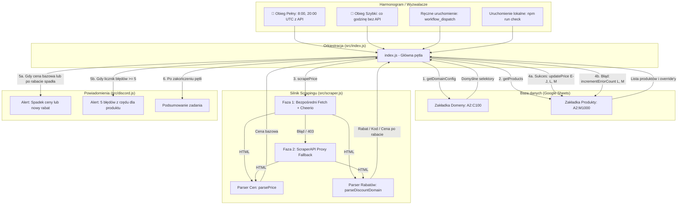
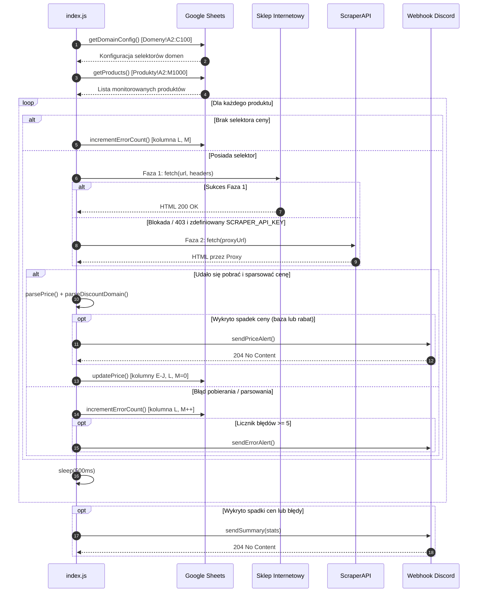

# 🏛️ Architektura Systemu — Price Tracker

Dokument ten opisuje strukturę techniczną, przepływ danych, podział na moduły oraz mechanizmy odpornościowe aplikacji **Price Tracker**.

---

## 1. Przegląd ogólny

Price Tracker to bezserwerowa aplikacja napisana w środowisku **Node.js (ES Modules)**, zaprojektowana z myślą o uruchamianiu w środowisku CI/CD (**GitHub Actions**) lub w środowisku lokalnym. Aplikacja nie wymaga własnej bazy danych ani stałego serwera — stan przechowywany jest bezpośrednio w **Google Sheets**, a komunikacja z użytkownikiem odbywa się poprzez webhooki **Discord**.



---

## 2. Podział na moduły

Struktura kodu zorganizowana jest w katalogu `src/` w postaci czterech wyspecjalizowanych modułów:

```
price-tracker/
├── .github/
│   └── workflows/
│       ├── price-check-full.yml  # Pełny obieg (8:00, 20:00) ze ScraperAPI
│       └── price-check-fast.yml  # Szybki obieg (co godzinę) bez ScraperAPI
├── docs/                         # Dokumentacja techniczna i poradniki
│   ├── ARCHITECTURE.md           # Ten plik
│   ├── CONFIGURATION.md          # Konfiguracja usług zewnętrznych
│   └── SCRAPING_GUIDE.md         # Dobór selektorów i parsowanie cen
├── src/
│   ├── index.js                  # Główny punkt wejścia i orkiestracja
│   ├── scraper.js                # Pobieranie stron, nagłówki, Cheerio, parsowanie cen i rabatów
│   ├── sheets.js                 # Integracja z Google Sheets API v4 (Produkty i Domeny)
│   └── discord.js                # Generowanie i wysyłka embedów Discord
├── .env.example                  # Szablon zmiennych środowiskowych
├── package.json                  # Konfiguracja projektu i zależności (ESM)
└── README.md                     # Główny opis projektu
```

---

### Moduł 1: `src/index.js` (Orkiestrator)

Odpowiada za sterowanie całym procesem wykonawczym:
1. **Inicjalizacja**: Loguje czas rozpoczęcia (strefa czasowa `Europe/Warsaw`).
2. **Pobranie konfiguracji**:
   - Wywołuje `getDomainConfig()` z `sheets.js` i ładuje domyślne selektory sklepów z zakładki `Domeny`.
   - Wywołuje `getProducts()` z `sheets.js` i pobiera listę produktów z zakładki `Produkty`.
3. **Pętla przetwarzania produktów**:
   - Dopasowuje selektory: jeśli produkt w zakładce `Produkty` posiada selektor override w kolumnie C lub D, ma on pierwszeństwo; w przeciwnym razie używany jest selektor domyślny dla danej domeny.
   - Wywołuje `scrapePrice(product.url, selectorCeny, selectorRabatu, hostname)`.
   - W przypadku błędu pobierania:
     - Zwiększa licznik błędów w arkuszu (`incrementErrorCount`).
     - Jeśli licznik osiągnie próg 5 błędów z rzędu (wielokrotność 5), wysyła powiadomienie ostrzegawcze na Discord (`sendErrorAlert`).
   - W przypadku sukcesu:
     - Wylicza cenę po rabacie (obsługuje procenty, kwoty oraz dedykowaną logikę sklepów np. Modivo, Wojas).
     - Aktualizuje najniższą historyczną cenę regularną oraz najniższą cenę po rabacie.
     - Wykrywa spadek ceny (bazy lub po rabacie) oraz przekroczenie progu alertu priorytetowego (`alertPonizej`).
     - Wysyła alert na Discord (`sendPriceAlert`).
     - Aktualizuje arkusz (`updatePrice`) zapisując nowe ceny, rabaty, datę sprawdzenia oraz zerując licznik błędów do `0`.
   - Wprowadza opóźnienie 500 ms (`setTimeout`) pomiędzy zapytaniami.
4. **Raportowanie**: Zbiera statystyki przebiegu i przesyła podsumowanie przez `sendSummary(stats)`.

---

### Moduł 2: `src/scraper.js` (Silnik Scrapingu)

Implementuje dwufazowy mechanizm pobierania i ekstrakcji cen oraz rabatów:

#### Faza 1: Zapytanie bezpośrednie (Direct Fetch)
- Wykorzystuje natywne `fetch` z Node.js z limitem czasu 45 sekund (`AbortSignal.timeout(45000)`).
- Generuje realistyczne nagłówki przeglądarki (`buildHeaders`): rotacja User-Agentów, nagłówki Sec-Fetch, Accept, Referer itp.
- Wykonuje do **2 prób** z losowym odstępem czasu (1000–3000 ms) w przypadku błędu sieciowego.
- Parsuje HTML za pomocą **Cheerio** (`cheerio.load(html)`).

#### Faza 2: ScraperAPI Proxy Fallback
- Jeśli Faza 1 napotka blokadę antybotową (np. Cloudflare, HTTP 403) oraz zdefiniowano zmienną `SCRAPER_API_KEY`, zapytanie kierowane jest przez bramkę proxy `api.scraperapi.com`.

#### Funkcje parsowania:
- **`parsePrice(text)`**: Ekstrahuje kwotę liczbową typu `number`, obsługując przecinki, kropki i formaty walutowe.
- **`parseDiscountDomain(text, domain)`**: Inteligentnie interpretuje informacje o rabatach:
  - **Wojas**: Wyciąga finalną cenę z tekstów typu *"Ten produkt kupisz za 181.30 zł z kodem EXTRA30"*.
  - **Modivo**: Wyciąga procent i kod promocyjny z tekstów typu *"extra -20% Kod: SEPT"*.
  - **Domyślnie**: Szuka symbolu `%` lub pierwszej liczby w tekście (np. `EXTRA30` $\rightarrow$ 30%).

---

### Moduł 3: `src/sheets.js` (Warstwa Danych)

Zarządza dwukierunkową komunikacją z Google Sheets API:
- **Autoryzacja**: `google.auth.GoogleAuth` z użyciem konta serwisowego (Service Account).
- **Konfiguracja domen (`getDomainConfig`)**:
  - Odczytuje zakres `Domeny!A2:C100`.
  - Normalizuje nazwy domen (usuwa protokoły `https://`, przedrostki `www.` i ścieżki).
- **Pobieranie produktów (`getProducts`)**:
  - Odczytuje zakres `Produkty!A2:M1000`.
  - Mapuje kolumny od A do M: Nazwa, URL, Selektor ceny, Selektor rabatu, Cena bez rabatu, Rabat, Cena z rabatem, Najniższa bez rabatu, Najniższa z rabatem, Największy zarejestrowany rabat, Alert poniżej, Ostatnie sprawdzenie, Licznik błędów.
  - Wymaga wypełnienia jedynie kolumn A (Nazwa) i B (URL) — selektory w wierszu są opcjonalne.
- **Zapis danych (`updatePrice`)**:
  - Aktualizuje kolumny E, F, G, H, I, J, L oraz M (resetuje licznik błędów na `0`).
- **Zliczanie błędów (`incrementErrorCount`)**:
  - Zwiększa licznik w kolumnie M (`Licznik błędów`) o 1 i aktualizuje datę w kolumnie L (`Ostatnie sprawdzenie`).

---

### Moduł 4: `src/discord.js` (Powiadomienia)

Wysyła estetyczne powiadomienia (Embedy) na webhook Discord:
- **Alert o spadku ceny (`sendPriceAlert`)**:
  - Prezentuje starą i nową cenę regularną oraz cenę po rabacie (z wyliczonym zyskiem).
  - Zielony pasek boczny dla standardowego spadku ceny.
  - Czerwony pasek z oznaczeniem 🚨, gdy cena osiągnęła próg `alertPonizej`.
- **Alert o błędach (`sendErrorAlert`)**:
  - Czerwony pasek ostrzegawczy wysyłany po osiągnięciu 5 kolejnych błędów dla produktu.
  - Informuje o powodzie (np. brak selektora, błąd selektora, timeout).
- **Raport podsumowujący (`sendSummary`)**:
  - Wysyłany po zakończeniu pętli, informuje o liczbie sprawdzonych pozycji, spadków cen, alertów i ewentualnych problemów.

---

## 3. Cykl życia pojedynczego uruchomienia (Execution Flow)



---

## 4. Strategia obsługi błędów i odporności

| Scenariusz błędu | Zachowanie systemu | Rezultat w arkuszu / Discordzie |
|---|---|---|
| **Kod HTTP 403 (Cloudflare/Bot block)** | Próba przejścia do Fazy 2 (ScraperAPI). Jeśli brak klucza lub brak sukcesu, oznaczany jako `blocked`. | Strona jest pomijana bez nabijania licznika błędów w kolumnie M; licznik `blocked` zwiększony w podsumowaniu konsoli. |
| **Błędny lub nieaktualny selektor CSS** | Cheerio nie odnajduje elementu w HTML. | `incrementErrorCount`: data w kolumnie L, licznik w kolumnie M rośnie o 1; po 5 błędach alert Discord. |
| **Brak selektora dla produktu i domeny** | Skrypt wykrywa brak reguły dla danej domeny i produktu. | `incrementErrorCount`: data w kolumnie L, licznik w kolumnie M rośnie o 1; po 5 błędach alert Discord. |
| **Błąd autoryzacji Google Sheets** | Przerwanie skryptu z kodem wyjścia `process.exit(1)`. | Zadanie w GitHub Actions kończy się statusem błędu (czerwony krzyżyk). |
| **Brak zmiennej `DISCORD_WEBHOOK_URL`** | Ostrzeżenie w konsoli `console.warn`, pominięcie wysyłki. | Skrypt kontynuuje pracę i aktualizuje arkusz bez wywoływania awarii. |
| **Nietypowy format ceny (spacje, waluty, przecinki)** | `parsePrice` normalizuje tekst do postaci liczbowej Float. | Prawidłowy zapis liczbowy w arkuszu. |
